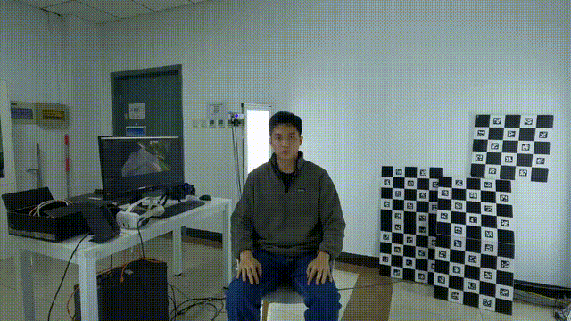
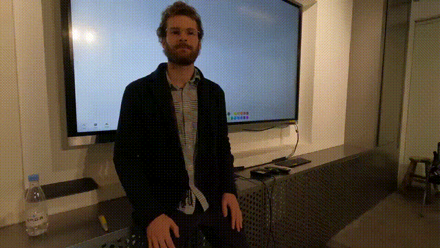
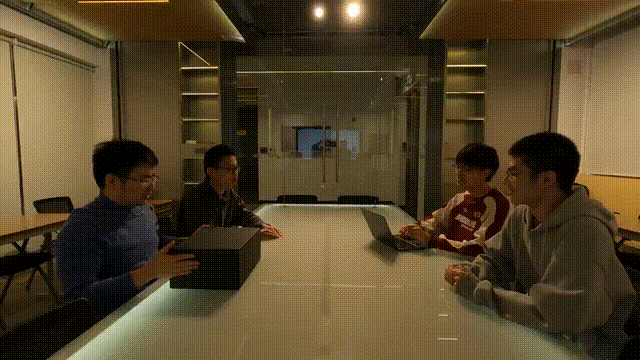
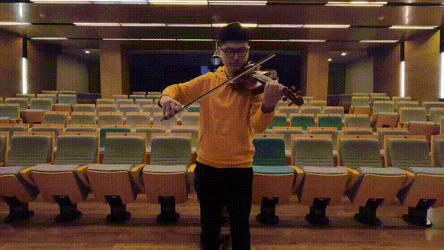
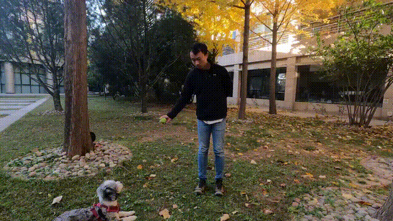
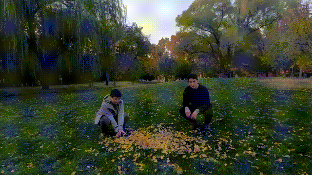

<div align="center">

# ImViD: Immersive Volumetric Videos for Enhanced VR Engagement

<h2 align="center">
  🌟 CVPR 2025 Highlight 🌟
</h2>
 
<h2 align="center">
   
  <strong><a href="https://www.tsinghua.edu.cn/">Tsinghua University</a></strong> &nbsp;&nbsp;
  <br>
   
  <strong><a href="https://www.migu.cn/">Migu Beijing Research Institute</a></strong> &nbsp;&nbsp;
   
  <strong><a href="http://www.ia.cas.cn/">IACAS</a></strong>
</h2>

[Zhengxian Yang]()\*,[Shi Pan]()\*, [Shengqi Wang]()*, [Haoxiang Wang](), [Li Lin](), [Guanjun Li](),

[Zhengqi Wen]()†, [Borong Lin](https://www.arch.tsinghua.edu.cn/info/Building%20Science%20and%20Technology/1804)†, [Jianhua Tao](https://www.au.tsinghua.edu.cn/info/1104/2986.htm)†, [Tao Yu](https://ytrock.com/)†,

<p align="center"><small>  
* Equal Contribution,  
† Corresponding Authors  
</small></p>

[](https://openaccess.thecvf.com/content/CVPR2025/html/Yang_ImViD_Immersive_Volumetric_Videos_for_Enhanced_VR_Engagement_CVPR_2025_paper.html)
[](https://arxiv.org/abs/2503.14359)
[](https://yzxqh.github.io/ImViD/)
[](https://www.youtube.com/watch?v=qRl8lEAIPGI)

<p align="center">
  <a href="https://www.qbitai.com/2025/06/293352.html">
    
  </a>
  <a href="https://mp.weixin.qq.com/s/Pq-4varyObluQDlO2wdZdg">
    
  </a>
  <a href="https://mp.weixin.qq.com/s/h37fSyYOfsucUrt1bIytHA">
    
  </a>
</p>
</div>

---

## Overview
<p align="center">
  
</p>

We introduce **ImViD**, a multi-view, multi-modal dataset featuring complete space-oriented data capture and various indoor/outdoor scenarios. The dataset includes high-resolution, synchronized audiovisual content captured at 5K resolution and 60 frames per second, with durations ranging from 1 to 5 minutes.

## Download
The full dataset is coming soon! You can currently download the sample data in our [Release Page](https://github.com/Metaverse-AI-Lab-THU/ImViD/releases/tag/v0.1).

The sample dataset includes:
- **Scene 1 videos** (300×5K@60 FPS, H.264 MP4)  
- **cameras.json** — intrinsic & extrinsic parameters for all **39** synchronized video streams

## Dataset Summary

| Scene      | Cameras | Static VPs | Takes | Strategy   | Avg. S-T Density (m³/s) | Viewing Space | Duration | Storage (GB) |
| :--------- | :-------:| :---------: | :----: | :---------: | :-----------------------: | :-----------: | :-------: | :----------: |
| Opera     | 39      | 1152      | 2     | 1–180°     | –                       | 180°          | 3:22     | 226         |
| Laboratory | 39      | 1225      | 2     | 2          | 0.10                    | 360°          | 1:42     | 137.3       |
| Classroom  | 39      | 1223      | 2     | 2          | 0.10                    | 360°          | 4:42     | 497         |
| Meeting    | 39      | 1223      | 1     | 1–360°     | –                       | 360°          | 3:16     | 114         |
| Rendition  | 39      | 1620      | 4     | 2          | 0.10                    | 360°          | 2:02     | 516         |
| Puppy      | 39      | 1404      | 3     | 2          | 0.10                    | 360°          | 1:50     | 359         |
| Playing    | 39      | 1224      | 2     | 2          | 0.10                    | 360°          | 1:10     | 220         |
| **Total**  | –       | –         | 16    | –          | –                       | –             | 38:46    | 2069.3      |

## Preview Clips

Below are low-bitrate preview clips for each scene. Click “Download” to access the full-resolution dataset.

<table align="center">
  <tr>
    <td align="center">
      <p><a href="https://github.com/Metaverse-AI-Lab-THU/ImViD/releases/tag/v0.1">Download</a></p>
      <br/>
      Scene 1: Opera
    </td>
    <td align="center">
      <p><a href="">Download</a></p>
      <br/>
      Scene 2: Laboratory
    </td>
    <td align="center">
      <p><a href="">Download</a></p>
      <br/>
      Scene 3: Classroom
    </td>
  <tr>
  <tr>
    <td align="center">
      <p><a href="">Download</a></p>
      <br/>
      Scene 4: Meeting
    </td>
    <td align="center">
      <p><a href="">Download</a></p>
      <br/>
      Scene 5: Rendition
    </td>
    <td align="center">
      <p><a href="">Download</a></p>
      <br/>
      Scene 6: Puppy
    </td>
  </tr>
  <tr>
    <td align="center" colspan="3">
      <p><a href="">Download</a></p>
      <br/>
      Scene 7: Playing
    </td>
  </tr>
</table>

## Usage

### Extracting Frames

To extract individual frames from the sample video:
```bash
python scripts/extract_frames.py \
    --input path/to/your_video_folder \
    --output path/to/output_frames_folder \
```

### Camera Parameters

The `cameras.json` file includes one entry per camera (39 total), each with:

- **id**, **camera_name**, **width**, **height**  
- **position** & **rotation**: world → camera transform
- **fx**, **fy**: focal lengths in pixels (from FOV)  
- **cx**, **cy**: principal point offsets in pixels  

To project a 3D world point `Xw = [X,Y,Z]` into image `(u,v)`:

```python
Xc = rotation @ Xw + position    # camera‐frame coords
u  = fx * (Xc[0]/Xc[2]) + cx      # pixel x
v  = fy * (Xc[1]/Xc[2]) + cy      # pixel y
```

## Moving Rig Captured Data

We also provide the captured data with the moving rig, which can be downloaded from our [Release Page]()

This data poses significant challenges for existing calibration methods, often resulting in errors and floaters. But we believe that this data will greatly contribute to the advancement of the field, and thus we also publicly releasing the data. For more details, refer to our [paper](https://arxiv.org/abs/2503.14359).

## TODO
- [x] Release the sample dataset and download instructions.
- [ ] Release the full dataset.
- [ ] Release the calibration code for the moving rig captured data.

> 🎉 Stay tuned for our upcoming work: an enhanced 4D Gaussian Splatting method for volumetric video.

## Citation
```bibtex
@InProceedings{Yang_2025_CVPR,
    author    = {Yang, Zhengxian and Pan, Shi and Wang, Shengqi and Wang, Haoxiang and Lin, Li and Li, Guanjun and Wen, Zhengqi and Lin, Borong and Tao, Jianhua and Yu, Tao},
    title     = {ImViD: Immersive Volumetric Videos for Enhanced VR Engagement},
    booktitle = {Proceedings of the Computer Vision and Pattern Recognition Conference (CVPR)},
    month     = {June},
    year      = {2025},
    pages     = {16554-16564}
}
```

## Contact

For access to the full dataset, please contact:
- **Zhengxian Yang**: zx-yang23@mails.tsinghua.edu.cn
- **Shengqi Wang**: shengqi-21@mails.tsinghua.edu.cn

## License
This project is licensed under the [CC BY 4.0](https://creativecommons.org/licenses/by/4.0/) license. You are free to share and adapt the material, provided you give appropriate credit, indicate if changes were made, and do not apply legal terms or technological measures that restrict others from using the material.
